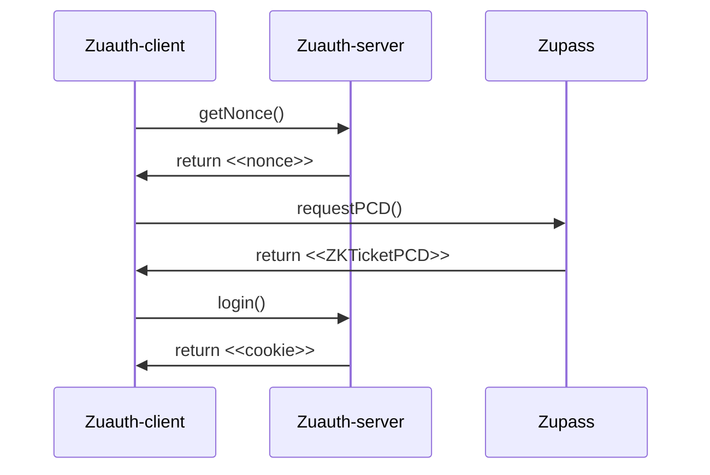

<p align="center">
    <h1 align="center">
        <picture>
            <source media="(prefers-color-scheme: dark)" srcset="https://github.com/cedoor/zuauth/blob/main/example/public/light-icon.png">
            <source media="(prefers-color-scheme: light)" srcset="https://github.com/cedoor/zuauth/blob/main/example/public/icon.png">
            
        </picture>
        Zuauth
    </h1>
    <p align="center">A simple toolkit designed to streamline the development of a zero-knowledge authentication system with Zupass tickets.</p>
</p>

<p align="center">
    <a href="https://github.com/proofcarryingdata">
        
    </a>
    <a href="https://github.com/cedoor/zuauth/blob/main/LICENSE">
        
    </a>
    <a href="https://www.npmjs.com/package/zuauth">
        
    </a>
</p>

|  The repository includes the `zuauth` package along with a documented example demonstrating how to create an authentication system using NextJS and IronSession. Use the [demo](https://zuauth.vercel.app/) and refer to the [tutorial](/#-tutorial) section below to understand how to integrate `zuauth` into your app. |
| ------------------------------------------------------------------------------------------------------------------------------------------------------------------------------------------------------------------------------------------------------------------------------------------------------------------------ |



## 🛠 Install

Copy the `.env` file as `.env.local`:

```bash
cp .env .env.local
```

And add your environment variables.

Install the `zuauth` package with npm:

```bash
npm i zuauth
```

or yarn:

```bash
yarn add zuauth
```

## 📜 Tutorial
This example includes an optional developer-friendly mode to select an arbitrary subset (from none to all) of ticket fields to be revealed during the authentication process. When the developer mode is off, only the pre-defined set of ticket fields (see step 2 below) will be displayed on the page. You can find multiple simple and specific components (e.g. Toggle) used to maintain the main page component easy to read and customize. The use of local storage allows consistency to be maintained after subsequent page refreshes.

> [!NOTE]  
> The example in the repository uses [`iron-session`](https://github.com/vvo/iron-session) to manage sessions, but you are of course free to integrate your preferred solution.

### Server

First, you need to create the server-side logic to generate a session nonce and perform the authentication. The example in this repository includes four functions: [login](example/src/pages/api/login.ts), [logout](example/src/pages/api/logout.ts), [nonce](example/src/pages/api/nonce.ts), and [user](example/src/pages/api/user.ts). Remember to add all necessary checks in your login function, particularly ensuring that the ticket has been issued by Zupass and that it is among the supported tickets.

### Client
Next, you can proceed with the client side.

1. Create a page for the Zupass popup:

https://github.com/cedoor/zuauth/blob/c7c052a0a0b27cee9c3be7bae5dea634d7fc6954/example/src/pages/popup.tsx#L1-L10

2. Create another page and define the default set of ticket fields to reveal.

https://github.com/cedoor/zuauth/blob/c7c052a0a0b27cee9c3be7bae5dea634d7fc6954/example/src/pages/index.tsx#L11-L23

3. Check if the user is logged-in.

https://github.com/cedoor/zuauth/blob/c7c052a0a0b27cee9c3be7bae5dea634d7fc6954/example/src/pages/index.tsx#L26-L45

3. Create a function to login, which generates a nonce and user's PCD:

https://github.com/cedoor/zuauth/blob/c7c052a0a0b27cee9c3be7bae5dea634d7fc6954/example/src/pages/index.tsx#L58-L70

4. Check when the PCD is generated and returned by the Zupass popup to call the login API:

https://github.com/cedoor/zuauth/blob/c7c052a0a0b27cee9c3be7bae5dea634d7fc6954/example/src/pages/index.tsx#L47-L56

> [!IMPORTANT]  
> When the user interacts with the Zupass popup, the output, which is the generated PCD, is not returned by any function but can be found in the `pcd` state variable within the `useZuAuth` hook. It's important to check if the value is defined.

5. Create a function to allow users to log out:

https://github.com/cedoor/zuauth/blob/c7c052a0a0b27cee9c3be7bae5dea634d7fc6954/example/src/pages/index.tsx#L72-L82

6. Create your UI:

https://github.com/cedoor/zuauth/blob/c7c052a0a0b27cee9c3be7bae5dea634d7fc6954/example/src/pages/index.tsx#L161-L194