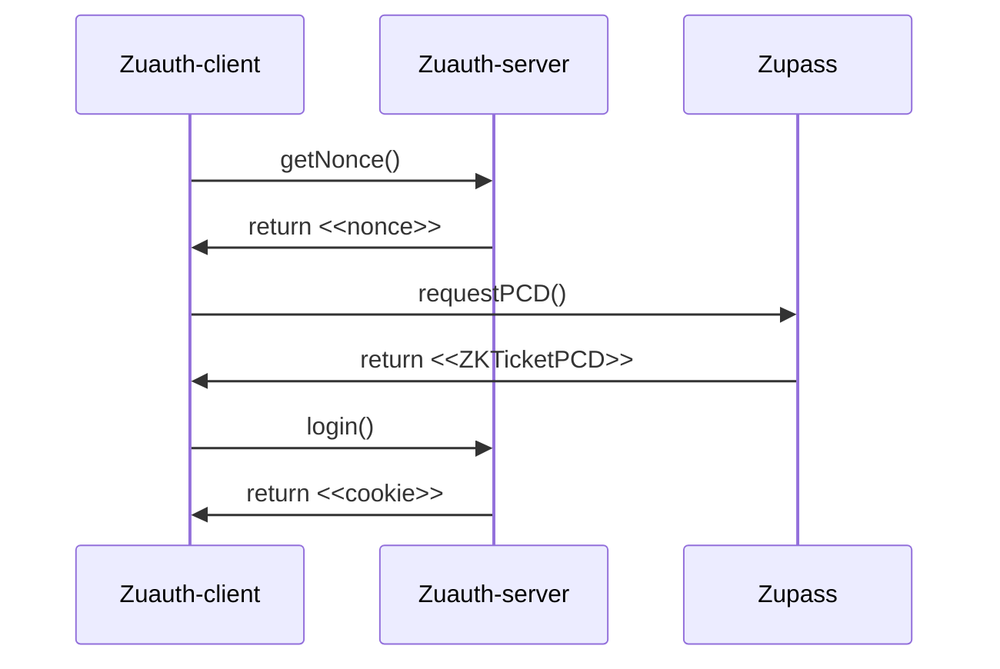

# ZuAuth Example

This example features an optional developer-friendly mode to choose an arbitrary subset (from none to all) of ticket fields to reveal during authentication with [zuauth](https://github.com/cedoor/zuauth/blob/main/README.md). With the developer mode disabled, only the predefined set of ticket fields (refer to the [Step 2](https://github.com/cedoor/zuauth/blob/main/README.md#client) below) will be displayed on the page. The main page component has multiple straightforward and tailored elements (e.g. Toggle) to ensure easy reading and customization. You can refer to an implementation of [iron-session](https://github.com/vvo/iron-session) for session management and usage of local storage to ensure consistency during page refreshes.


## 🛠 Install

Clone this repository:

```bash
git clone https://github.com/cedoor/zuauth.git
```

Navigate to the `example/` folder and install the dependencies:

```bash
cd zuauth/example && yarn # or npm i
```

## 📜 Usage

Copy the `.env` file as `.env.local`:

```bash
cp .env .env.local
```

And add your environment variables.